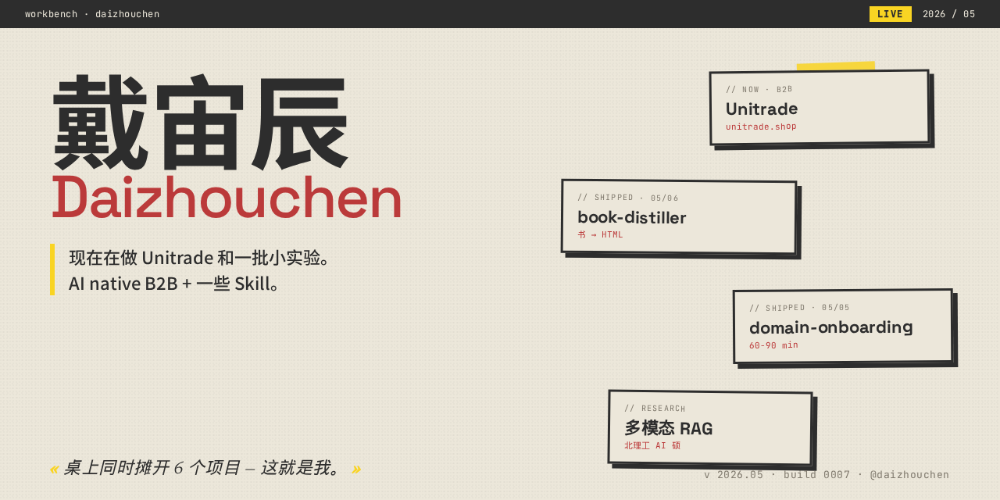
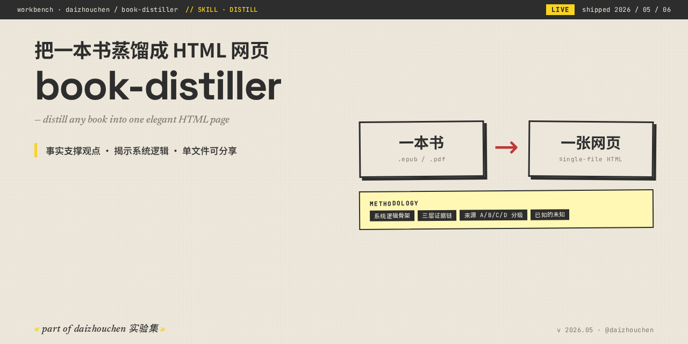
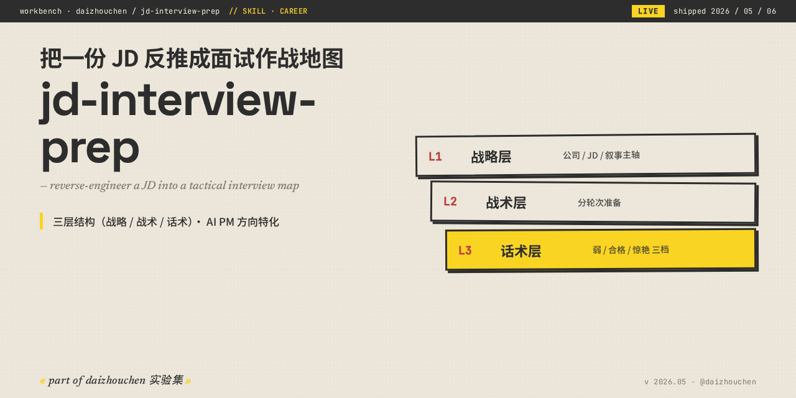
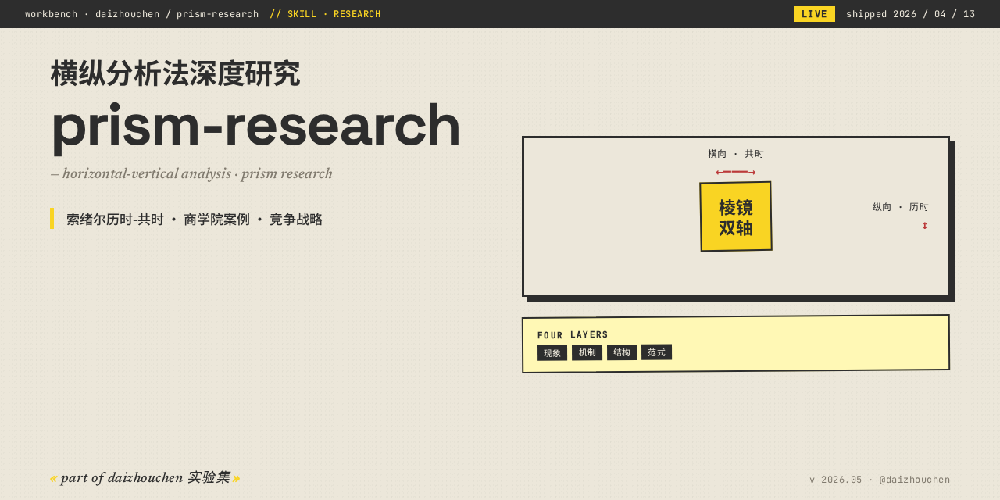

  

# 戴宙辰 Daizhouchen

> 现在在做 Unitrade 和一批小实验。AI native B2B + 一些 Skill。

2026 年我在做 AI Native B2B（[Unitrade](https://unitrade.shop)）。下面是我顺手做出来的一些实验。

---

## 现在在做

<table>
  <tr>
    <td width="33%" valign="top">
      
      <h3>Unitrade · AI Native B2B</h3>
      
<a href="https://unitrade.shop"><code>unitrade.shop</code></a> · 创始合伙人

      
智能选品、跨境匹配、自动化询盘——把 B2B 国际贸易重新做一遍。这次所有 agent 都是 AI native 的。

    </td>
    <td width="33%" valign="top">
      
      <h3>book / movie / domain · distiller 系列</h3>
      
<a href="https://github.com/daizhouchen/book-distiller">book</a> · <a href="https://github.com/daizhouchen/movie-distiller">movie</a> · <a href="https://github.com/daizhouchen/domain-onboarding">domain</a> · <a href="https://github.com/daizhouchen/jd-interview-prep">jd</a>

      
把书/电影/领域/JD 蒸馏成一张你愿意打开的网页。HTML 单文件、内含方法论框架，不是又一个 LLM 套壳。

    </td>
    <td width="33%" valign="top">
      
      <h3>多模态 RAG · 图学习</h3>
      
北理工 AI 硕在读

      
方向：大模型 × 图学习 × 多模态 RAG。参与过 llm-kg 军科委 + 国防科大合作。学术与工程之间的桥。

    </td>
  </tr>
</table>

---

## 刚做完
<!-- BEGIN recently-pushed -->

- [wechat-mp-writer](https://github.com/daizhouchen/wechat-mp-writer) — 微信公众号内容创作与发布 Claude Code Skill · `2026-05-14`
- [jd-interview-arsenal](https://github.com/daizhouchen/jd-interview-arsenal) — Knowledge Arsenal builder for AI PM interviews · 6 大 Library × 7 slot 标准化武器卡 · 配套 jd-interview-pr… · `2026-05-07`
- [jd-interview-prep](https://github.com/daizhouchen/jd-interview-prep) — 把一份 JD 反推成一张面试作战地图 · 三层结构（战略/战术/话术）· AI PM 方向特化 · 单文件 HTML 典雅风 · Claude Code skill · `2026-05-07`
- [resume-builder](https://github.com/daizhouchen/resume-builder) — Claude skill: 5+1 阶段流程的简历导师 — 国际商务高级视觉调 + 内化的内容引擎（Spence 信号传递 / 金字塔原理 / 英雄之旅 / 文化资本） · `2026-05-07`
- [market-research-skill](https://github.com/daizhouchen/market-research-skill) — Adaptive market demand analysis skill for Claude Code - 自适应市场需求分析 Skill · `2026-05-07`

<!-- END recently-pushed -->

> 这一栏由 [GitHub Actions](.github/workflows/refresh.yml) 每天 00:00 UTC 从 push events 自动刷新。

---

## 下一个

- 把 book-distiller 接入更多源（newsletters / paper PDFs / podcast 转录）
- 多模态 RAG × 图学习方向的科研论文
- ……

---

## 联系 / 订阅

- **email** — `<待填工作邮箱>`
- **wechat** — 见简历
- **blog** — [unitrade.shop](https://unitrade.shop)

关于这个 Profile 的设计

按"实验现场"思路布局，不按"职业身份"。
"现在在做"是主线，"刚做完"是节奏证据，"下一个"是方向感。
不要 trophies、不要 profile-views、不要满屏徽章——这些是 AI slop 的信号。

视觉方向：**workbench-collage** · 米黄 + 工业灰 + 警示黄 + 红 · 错位拼贴 + 5px solid 阴影。
完整设计稿见 [github-makeover ccpm 仓](https://github.com/daizhouchen/github-makeover)（私有）。

