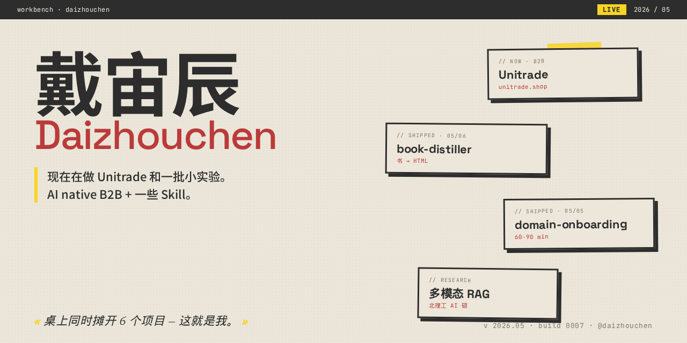
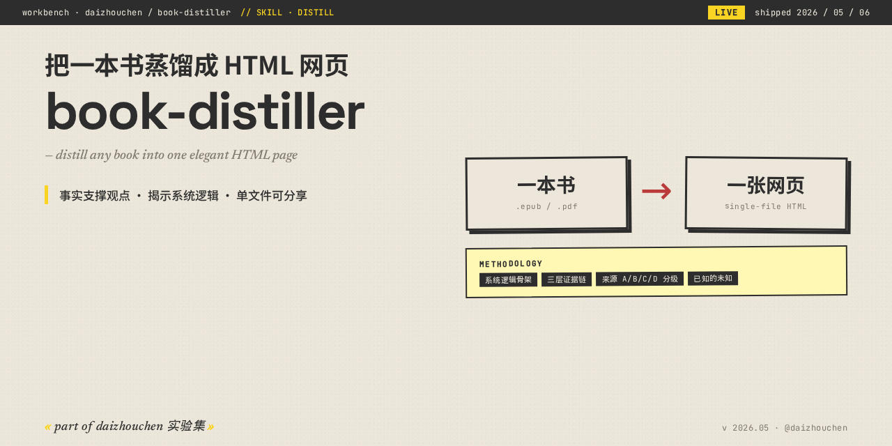
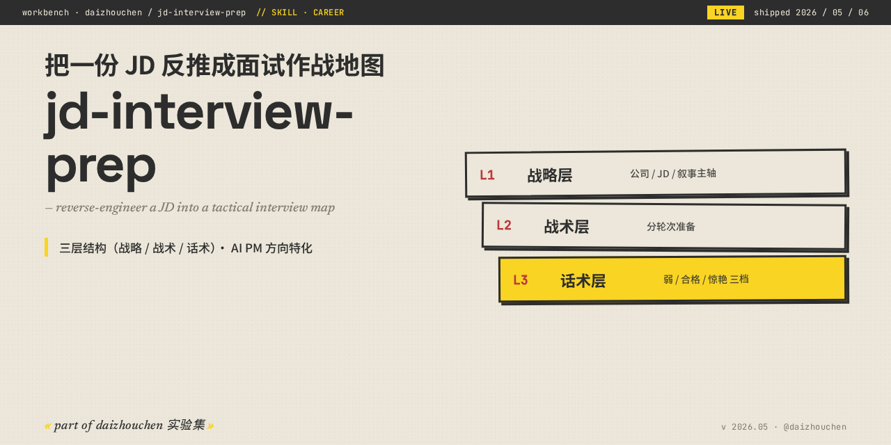
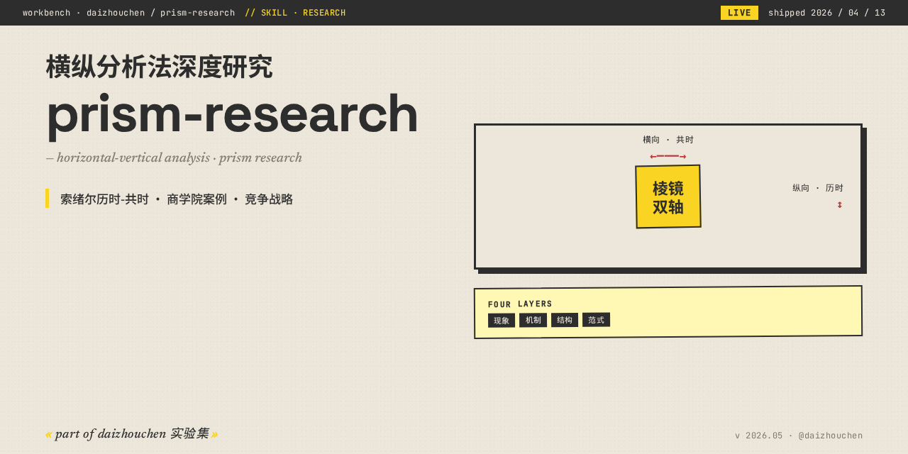

  

# 戴宙辰 Daizhouchen

> AI 产品经理 / 独立实验者。现在在做 [Unitrade](https://unitrade.shop)（AI Native B2B）和一批小实验。

用研究的方式做产品，用产品的方式做研究。完整作品集站点 → **[daizhouchen.github.io](https://daizhouchen.github.io)**

---

## 现在在做

<table>
  <tr>
    <td width="33%" valign="top">
      
      <h3>Unitrade · AI Native B2B</h3>
      
<a href="https://unitrade.shop"><code>unitrade.shop</code></a> · 创始合伙人

      
智能选品、跨境匹配、自动化询盘——把 B2B 国际贸易重新做一遍。这次所有 agent 都是 AI native 的。

    </td>
    <td width="33%" valign="top">
      
      <h3>book / movie / domain · distiller 系列</h3>
      
<a href="https://github.com/daizhouchen/book-distiller">book</a> · <a href="https://github.com/daizhouchen/movie-distiller">movie</a> · <a href="https://github.com/daizhouchen/domain-onboarding">domain</a> · <a href="https://github.com/daizhouchen/jd-interview-prep">jd</a>

      
把书/电影/领域/JD 蒸馏成一张你愿意打开的网页。HTML 单文件、内含方法论框架，不是又一个 LLM 套壳。

    </td>
    <td width="33%" valign="top">
      
      <h3>多模态 RAG · 图学习</h3>
      
北理工 AI 硕在读

      
方向：大模型 × 图学习 × 多模态 RAG。参与过 llm-kg 军科委 + 国防科大合作。学术与工程之间的桥。

    </td>
  </tr>
</table>

---

## 作品集导览

三条主线，按面试官的阅读顺序排列。商业与研究敏感项目以私有仓库承载（标 🔒，可沟通后提供访问）。

### 🔬 AI 研究 · 多模态 RAG 与视觉 GEO

| 项目 | 一句话 |
|---|---|
| CoGEO 🔒 | VLM 引导的视觉检索优化框架：Recall@10 最高 +30.9pp，SSIM > 0.98。论文 + 代码 + 7 篇文档 |
| HonestVGEO 🔒 | 锚点解耦的留出式评测协议 + CoGEO / AE-CoGEO 参考实现 |
| CoGEO 锚点解耦评测 🔒 | ICMR 2026：ESCI + Food-101 上的 4 路攻击对照评测 |
| [ML-PD](https://github.com/daizhouchen/ML-PD) | 代谢组学数据 × 机器学习的帕金森病诊断 |

### 🏗️ 产品工程 · UniTrade 全家桶与落地 MVP

| 项目 | 一句话 |
|---|---|
| UniTrade 商品数据底座 🔒 | 28 字段规范 + 866 节点分类树 + 9141 冷启动商品（[unitrade.shop](https://unitrade.shop)） |
| UniTrade 平台源码与迁移 🔒 | Java 全栈源码 + 9141 件旧商品的迁移交付 |
| 幕境 mujing 🔒 | 线下场地沉浸式活动引擎 MVP（TypeScript） |
| 能力森林 🔒 | 感统轻训练微信小程序，已上线（CloudBase） |

### 🤖 AI Agent 工程 · Claude Code Skills（全部公开）

| 仓库 | 一句话 |
|---|---|
| [superpm](https://github.com/daizhouchen/superpm) | 给 AI Agent 用的 spec 驱动项目管理：7 阶段生命周期 + 质量门 |
| [openclaw-skills](https://github.com/daizhouchen/openclaw-skills) | 11 天 11 个 Skill 实验：10 个开发者工具 Skill 合集 |
| [prism-research](https://github.com/daizhouchen/prism-research) | 棱镜研究：穿透式深度调研 → 可打印 HTML 报告 |
| [claude-product-designer](https://github.com/daizhouchen/claude-product-designer) | 产品想法 → 大师级 0→1 设计文档，通过率 100% |
| [book-distiller](https://github.com/daizhouchen/book-distiller) | distiller 系列起点：一本书 → 一张典雅 HTML 网页 |

> 更多仓库与完整叙述见 **[作品集站点](https://daizhouchen.github.io)**；简历可通过邮件 / 微信索取。

---

## 刚做完
<!-- BEGIN recently-pushed -->

- [daizhouchen.github.io](https://github.com/daizhouchen/daizhouchen.github.io) — Dai Zhouchen · AI Product Portfolio · `2026-08-03`

<!-- END recently-pushed -->

> 这一栏由 [GitHub Actions](.github/workflows/refresh.yml) 每天 00:00 UTC 从 push events 自动刷新。

---

## 下一个

- 把 book-distiller 接入更多源（newsletters / paper PDFs / podcast 转录）
- 多模态 RAG × 图学习方向的科研论文
- Unitrade 的 agent 化询盘闭环
- ……

---

## 联系 / 订阅

- **email** — `<待填工作邮箱>`
- **wechat** — 见简历
- **portfolio** — [daizhouchen.github.io](https://daizhouchen.github.io)
- **blog** — [unitrade.shop](https://unitrade.shop)

关于这个 Profile 的设计

按"实验现场"思路布局，不按"职业身份"。
"现在在做"是主线，"作品集导览"是面试官入口，"刚做完"是节奏证据，"下一个"是方向感。
不要 trophies、不要 profile-views、不要满屏徽章——这些是 AI slop 的信号。

视觉方向：**workbench-collage** · 米黄 + 工业灰 + 警示黄 + 红 · 错位拼贴 + 5px solid 阴影。
完整设计稿见 [github-makeover ccpm 仓](https://github.com/daizhouchen/github-makeover)（私有）。

<!-- cache-bust: 2026-08-04 -->
